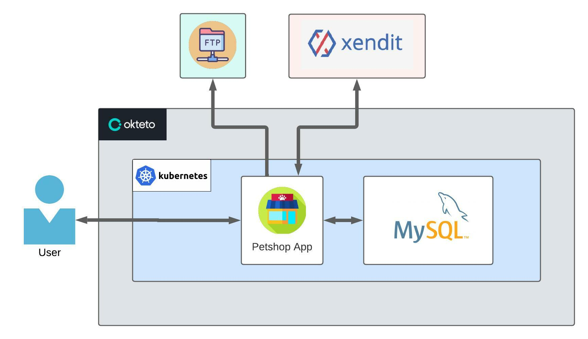

<div id="top"></div>

[](https://github.com/ellashella24/petshop/graphs/contributors)

# Petshop

<!-- PROJECT LOGO -->
<div align="center">
  <a href="https://github.com/ellashella24/petshop">
    
  </a>

  <h3 align="center">Petshop</h3>

  <p align="center">
    A RESTful API Application for Petshop
    <br />
    <a href="https://github.com/ellashella24/petshop"><strong>Explore the docs »</strong></a>
    <br />
    <a href="https://whimsical.com/petshop-RtwdxfQTB8e72AY681qRBj">Wireframe</a>
    ·
    <a href="https://lucid.app/lucidchart/7a103c4c-9aac-44e1-896f-b9bca4a8dc34/edit?invitationId=inv_c1d4dfe4-840d-4ce2-80fb-18845710d049">Use Case</a>
    ·
    <a href="https://lucid.app/lucidchart/8877930f-c2e0-4c85-b233-7c93dd82a306/edit?invitationId=inv_bccb8e74-b801-4419-ba8a-cc078d80f84a">Flowchart</a>
    ·
    <a href="https://lucid.app/lucidchart/1e35b3e5-1de0-40a7-ba26-db0e85763fda/edit?invitationId=inv_5eb6ec4e-9b6f-4db6-bb62-e18e2e922d95">ERD</a>
    ·
    <a href="https://github.com/ellashella24/petshop/issues">Report Bug</a>
  </p>
</div>

<!-- TABLE OF CONTENTS -->
# Table of Contents
<ol>
    <li>
      <a href="#about-the-project">About The Project</a>
      <ul>
        <li><a href="#descriptioN">Description</a></li>
        <li><a href="#built-with">Built With</a></li>
      </ul>
    </li>
    <li>
      <a href="#software-design">Software Design</a>
      <ul>
        <li><a href="#high-level-architecture">High Level Architecture</a></li>
        <li><a href="#entity-relational-diagram">Entity Relational Diagram</a></li>
        <li><a href="#flowchart">Flowchart</a></li>
        <li><a href="#use-case">Use Case</a></li>
        <li><a href="#wireframe">Wireframe</a></li>
      </ul>
    </li>
    <li>
      <a href="#code-quality">Code Quality</a>
      <ul>
        <li><a href="#structuring">Structuring</a></li>
        <li><a href="#unit-test">Unit Test</a></li>
      </ul>
    </li>
    <li><a href="#help">Help</a></li>
    <li><a href="#endpoint">Endpoints</a></li>
    <li>
      <a href="#getting-started">Getting Started</a>
      <ul>
        <li><a href="#how-to-use">How To Use</a></li>
      </ul>
    </li>
    <li><a href="#contact">Contact</a></li>
    <li><a href="#acknowledgments">Acknowledgments</a></li>
  </ol> 

<!-- ABOUT THE PROJECT -->
## About The Project
### Description

- A RESTful API App for Petshop. 
- Allow user to be a pet shop owner to sell their services and products or to be a customer to buy them. 
- With this app, pet shop owners will be helped to market the products and services so that they can be easily reached by customers and they will be helped to get the products and services that are needed by their pets easily.
- Build with Golang, Echo Framework, MySQL adn GORM for manage repository, Xuri Excelize for Export List Product Selling to Excel, FTP to store Image Product to server, Xendit API for Payment Gateway, Deploy the project on Okteto (soon).

### Built With

* [Go](https://go.dev/)
* [Echo Framework](https://echo.labstack.com/)
* [MySQL](https://www.mysql.com/)
* [GORM](https://gorm.io/index.html)


<p align="right">(<a href="#top">back to top</a>)</p>

## Software Design
### High Level Architecture

HLA design for this project can be seen in the picture below : 

<a href="https://github.com/ellashella24/petshop">
    
  </a>

### Entity Relational Diagram

ERD that used in this project can be seen in the following link : [ERD Petshop](https://lucid.app/lucidchart/1e35b3e5-1de0-40a7-ba26-db0e85763fda/edit?invitationId=inv_5eb6ec4e-9b6f-4db6-bb62-e18e2e922d95)

### Flowchart
Use case diargam for this project can be seen in the following link :  [Flowchart Petshop](https://lucid.app/lucidchart/8877930f-c2e0-4c85-b233-7c93dd82a306/edit?invitationId=inv_bccb8e74-b801-4419-ba8a-cc078d80f84a)

### Use Case
Use case diargam for this project can be seen in the following link : [Use Case Petshop](https://lucid.app/lucidchart/7a103c4c-9aac-44e1-896f-b9bca4a8dc34/edit?invitationId=inv_c1d4dfe4-840d-4ce2-80fb-18845710d049)

### Wireframe
Wireframe for this project can be seen in the following link : [Wireframe Petshop](https://whimsical.com/petshop-RtwdxfQTB8e72AY681qRBj)

<p align="right">(<a href="#top">back to top</a>)</p>


## Code Quality
This project use Layered Architure to organized each components into spesific function  

### Structuring
  ```sh
    petshop
    ├── config                
    │     └──config.go           
    ├── constants  
    │     └──constants.go    
    ├── delivery                 
    │     └──common
    │     │   ├── common.go           
    │     │   └── http_responses.go   
    │     └──controller
    │     │   ├── user
    │     │   ├── formatter_req.go    
    │     │   ├── formatter_res.go    
    │     │   ├── user_test.go       
    │     │   └── users.go                    
    │     └──routes  
    │         └── routes.go           
    ├── entity                
    │     └── user.go          
    ├── repository                  
    │     ├── user_test.go    
    │     └── users.go          
    ├── service                 
    │     └── ftp.go   
    │     └── export-excel.go   
    ├── utils                 
    │     └── mysqldriver.go         
    ├── .env                    
    ├── .gitignore              
    ├── go.mod                  
    ├── go.sum                  
    ├── main.go                 
    └── README.md    
  ```

### Unit Test
The following are the results of unit test coverage for this project shown in the image below

<p align="right">(<a href="#top">back to top</a>)</p>

## Help
1. Config <br />
    Contains list of configuration of the project
2. Constants <br />
    Contains list variable that used in other components
3. Delivery <br />
    Contains list of functions that receive the request and parse anything that is required from the request
  - Common <br />
    Contains list of request and response format 
  - Controller <br />
    Contains list of function to receive request and forward the request to other component, also receive and forward the response from other component
  - Controller Unit Test <br />
    Contains list of functions to test each function in controller
  - Routes <br />
    Contains list of link that use to access each endpoints 
4. Entity <br />
    Contains model for each table 
5. Repository <br />
    Contains list of functions that receive the request from controller and stores the data in database
6. Service <br />
    Contains list of function that require other components outside the project
7. env <br />
    Contains list of environment variable to run the project
8. gitignore <br />
    Contain list of directory / file name that not will not be pushed on github
9. main.go <br />
    Contains list of code that to be executed first to run the app

<p align="right">(<a href="#top">back to top</a>)</p>

## Endpoints
List of endpoint in this project can be seen in the following link : [OpenAPI Petshop](https://app.swaggerhub.com/apis-docs/ellashella24/petshop/1.0.0)

<p align="right">(<a href="#top">back to top</a>)</p>


<!-- GETTING STARTED -->
## Getting Started

### How To Use

1. Clone the repo
   ```sh
   git clone https://github.com/ellashella24/petshop.git
   ```

2. Create .env file
    ```go
    PORT : "PORT_TO_ACCESS_YOUR_PROJECT"
    ADDRESS : "YOUR_PROJECT_ADDRESS"
    DRIVER : "mysql"
    DB_NAME : "DATABASE_NAME"
    DB_PORT : "YOUR_DATABASE_PORT"
    DB_USERNAME : "YOUR_DATABASE_USERNAME"
    DB_PASSWORD : "YOUR_DATABASE_PASSWORD"
    ```

3. Run the program
    ```go
    go run main.go
    ```

<p align="right">(<a href="#top">back to top</a>)</p>

<!-- CONTACT -->
## Contact
* Naufal Aammar Hibatullah - [Github](https://github.com/nflhibatullah) · [LinkedIn](https://www.linkedin.com/in/naufal-hibatullah-441a58222/)
* Niendhitta Tamia Lassela - [Github](https://github.com/ellashella24) · [LinkedIn](https://www.linkedin.com/in/ntlassela/)

<p align="right">(<a href="#top">back to top</a>)</p>

<!-- ACKNOWLEDGMENTS -->
## Acknowledgments

* [Layered Architecture](https://medium.com/swlh/developing-a-web-application-in-go-using-the-layered-architecture-8fc13209c808)
* [Readme Template](https://github.com/othneildrew/Best-README-Template)

<p align="right">(<a href="#top">back to top</a>)</p>
