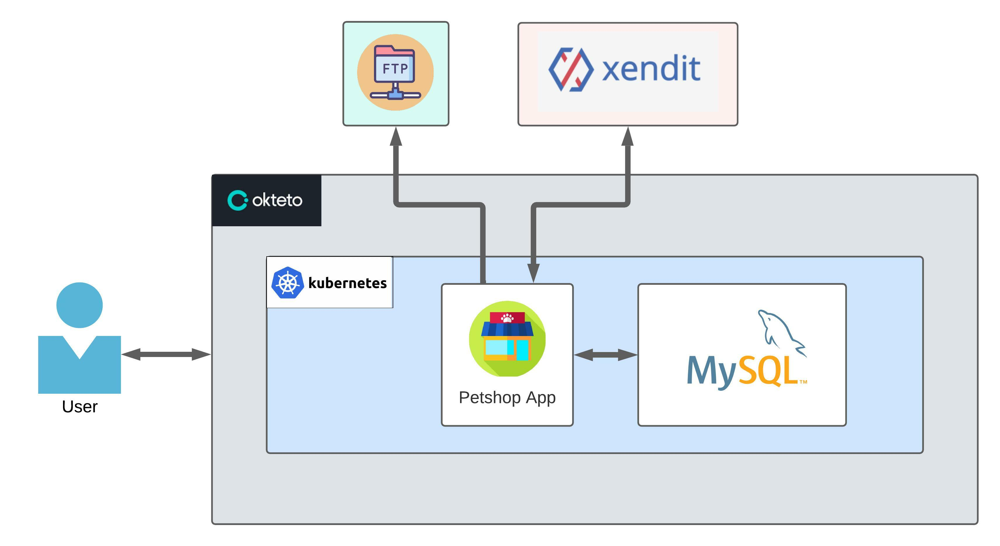

<div id="top"></div>

# Petshop

<!-- PROJECT LOGO -->
<div align="center">
  <a href="https://github.com/ellashella24/petshop">
    
  </a>

  <h3 align="center">Petshop</h3>


  <p align="center">
    A RESTful API Application for Petshop
    <br />
    <div id = "other-software-design"></div>
    <a href="https://whimsical.com/petshop-RtwdxfQTB8e72AY681qRBj">Wireflow</a>
    ·
    <a href="https://lucid.app/lucidchart/7a103c4c-9aac-44e1-896f-b9bca4a8dc34/edit?invitationId=inv_c1d4dfe4-840d-4ce2-80fb-18845710d049">Use Case</a>
    ·
    <a href="https://lucid.app/lucidchart/8877930f-c2e0-4c85-b233-7c93dd82a306/edit?invitationId=inv_bccb8e74-b801-4419-ba8a-cc078d80f84a">Flowchart</a>
    ·
    <a href="https://lucid.app/lucidchart/1e35b3e5-1de0-40a7-ba26-db0e85763fda/edit?invitationId=inv_5eb6ec4e-9b6f-4db6-bb62-e18e2e922d95">ERD</a>
    ·
    <a href="https://app.swaggerhub.com/apis-docs/ellashella24/petshop/1.0.0">Open API</a>
  </p>
</div>
<br />

[](https://github.com/ellashella24/petshop/graphs/contributors)

<!-- TABLE OF CONTENTS -->
# Table of Contents
<ol>
    <li>
      <a href="#about-the-project">About The Project</a>
      <ul>
        <li><a href="#description">Description</a></li>
      </ul>
    </li>
    <li>
      <a href="#tech-stack">Tech Stack</a></li>
      <ul>
        <li><a href="#restful-api">RESTful API</a></li>
        <li><a href="#deployment">Deployment</a></li>
        <li><a href="#collaboration">Collaboration</a></li>
      </ul>
    </li>
    <li>
      <a href="#software-design">Software Design</a>
      <ul>
        <li><a href="#high-level-architecture">High Level Architecture</a></li>
      </ul>
    </li>
    <li>
      <a href="#code-quality">Code Quality</a>
      <ul>
        <li><a href="#structuring">Structuring</a></li>
        <li><a href="#unit-test">Unit Test</a></li>
      </ul>
    </li>
    <li>
      <a href="#getting-started">Getting Started</a>
      <ul>
        <li><a href="#how-to-use">How To Use</a></li>
      </ul>
    </li>
    <li><a href="#contact">Contact</a></li>
    <li><a href="#acknowledgments">Acknowledgments</a></li>
  </ol> 

<!-- ABOUT THE PROJECT -->
## About The Project
### Description
- An app that allow user to be a pet shop owner to sell their services and products or to be a customer to buy them. 
- Pet shop owners will be helped to market the products and services so that they can be easily reached by customers and they will be helped to get the products and services that are needed by their pets easily.
- Build with Golang, Echo Framework, MySQL adn GORM for manage repository, Xuri Excelize for Export List Product Selling to Excel, FTP to store Image Product to server, Xendit API for Payment Gateway, Deploy the project on [Okteto](https://ellashella24.cloud.okteto.net).

## Tech Stack
### RESTful-API
- [Go](https://go.dev/)
- [Echo Framework](https://echo.labstack.com/)
- [MySQL](https://www.mysql.com/)
- [GORM](https://gorm.io/index.html)
- [Xuri Excelize](https://xuri.me/excelize/)
- [Xendit](https://www.xendit.co/id/?utm_source=google&utm_medium=cpc&utm_campaign=BKWS-Exact-ID-ID&utm_content=payment-gateway&utm_term=xendit)

### Deployment
- [Docker](https://www.docker.com/)
- [Kubernetes](https://kubernetes.io/)

### Collaboration 
- [Trello](https://trello.com/)
- [Github](https://github.com/)


<p align="right">(<a href="#top">back to top</a>)</p>

## Software Design
### High Level Architecture

HLA design for this project shown in the picture below



Follow this link to see the other software design : <a href="#other-software-design">Other Software Design</a>

<p align="right">(<a href="#top">back to top</a>)</p>


## Code Quality
This project use Layered Architure to organized each components into spesific function  

### Structuring
  ```sh
    petshop
    ├── config                        
    │     └──config.go                # Contains list of configuration of the project
    ├── constants                     
    │     └──constants.go             # Contains list constant variable
    ├── delivery                      # Contains list of component for handle request dan response
    │     └──common                   # Contains list of http request format based on the result from controller 
    │     │   ├── common.go           # Contains list of http request format
    │     │   └── http_responses.go   
    │     └──controller               # Contains list of component that receive the request and return a response
    │     │   ├── user
    │     │   ├── formatter_req.go    # Contains list of request format for each function on the controller
    │     │   ├── formatter_res.go    # Contains list of response format for each function on the controller
    │     │   ├── user_test.go        # Contains list of function for test each function on the controller
    │     │   └── users.go            # Contains list of controller for each entity    
    │     └──routes  
    │         └── routes.go           # Contains list of route to access each function on controller  
    ├── entity                        # Contains model all entity
    │     └── user.go                 # Contains model for spesific entity
    ├── repository                    # Contains list of functions that process the request and stores it in database
    │     ├── user_test.go            # Contains list of function for test each function on the repository
    │     └── users.go                # Contains list of repository for each entity
    ├── service                       # Contains list of function to access other components outside the project
    │     └── ftp.go                  # Containts list of function to manage files upload to the ftp
    │     └── export-excel.go         # Containts list of function to stores response data into the excel files
    ├── utils                         # Contains list of function to config each type of database
    │     └── mysqldriver.go          # Contains list of function to config MySQL type database
    ├── .env                          # Contains list of environment variable to run the project 
    ├── .gitignore                    # Contains list of directory/file name that will igonored when push project
    ├── go.mod                  
    ├── go.sum                  
    ├── main.go                       # Contains list of component that need to be executed first to run the app
    └── README.md    
  ```

### Unit Test
Coverage result on all functions is 99.2% which the most functions have reached 100% coverage. Coverage result for each function shown in the picture below


<p align="right">(<a href="#top">back to top</a>)</p>

<!-- GETTING STARTED -->
## Getting Started

### How To Use

1. Clone the repo
   ```sh
   git clone https://github.com/ellashella24/petshop.git
   ```

2. Create .env file
    ```go
    PORT : "PORT_TO_ACCESS_YOUR_PROJECT"
    ADDRESS : "YOUR_PROJECT_ADDRESS"
    DRIVER : "mysql"
    DB_NAME : "DATABASE_NAME"
    DB_PORT : "YOUR_DATABASE_PORT"
    DB_USERNAME : "YOUR_DATABASE_USERNAME"
    DB_PASSWORD : "YOUR_DATABASE_PASSWORD"
    ```

3. Run the program
    ```go
    go run main.go
    ```

<p align="right">(<a href="#top">back to top</a>)</p>

<!-- CONTACT -->
## Contact
* Naufal Aammar Hibatullah - [Github](https://github.com/nflhibatullah) · [LinkedIn](https://www.linkedin.com/in/naufal-hibatullah-441a58222/)
* Niendhitta Tamia Lassela - [Github](https://github.com/ellashella24) · [LinkedIn](https://www.linkedin.com/in/ntlassela/)

<p align="right">(<a href="#top">back to top</a>)</p>

<!-- ACKNOWLEDGMENTS -->
## Acknowledgments

* [Layered Architecture](https://medium.com/swlh/developing-a-web-application-in-go-using-the-layered-architecture-8fc13209c808)
* [Readme Template](https://github.com/othneildrew/Best-README-Template)

<p align="right">(<a href="#top">back to top</a>)</p>
